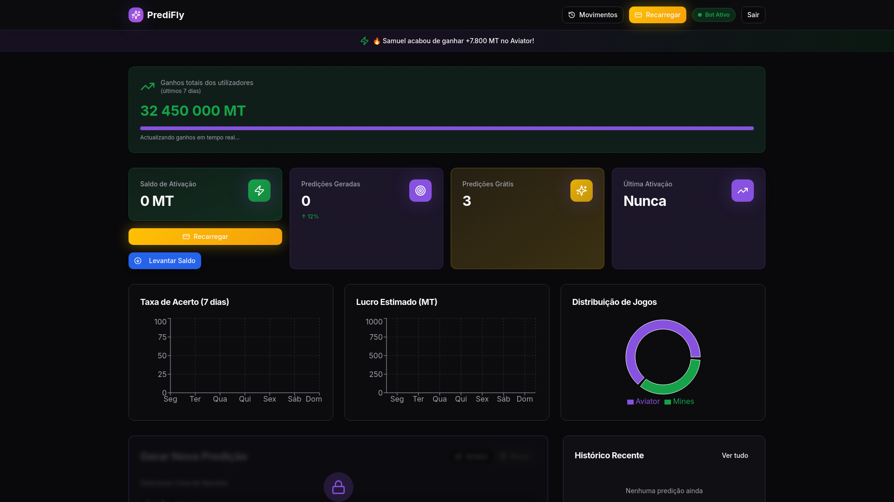

# 🚀 Predidly Bot

Sistema inteligente de predições automáticas para Aviator e Mines com até 96% de precisão.



## 📋 Sobre o Projeto

O **Predidly Bot** é uma plataforma avançada de predições automáticas que utiliza algoritmos inteligentes para gerar sinais de alta precisão para jogos como Aviator e Mines.

### ✨ Características

- 🤖 **Bot Automático** - Predições geradas automaticamente 24/7
- 📊 **Alta Precisão** - Taxa de acerto de até 96%
- ⚡ **Tempo Real** - Sinais instantâneos sem delay
- 💰 **Gestão de Banca** - Sistema integrado de gerenciamento
- 📱 **Responsivo** - Funciona perfeitamente em mobile e desktop
- 🔒 **Seguro** - Proteções anti-cópia implementadas

## 🛠️ Tecnologias

- React 18
- TailwindCSS
- Radix UI
- Vercel (Hosting)
- RatixPay (Pagamentos)

## 🚀 Deploy

Este projeto está configurado para deploy automático no Vercel.

### Deploy Manual

```bash
# Instalar Vercel CLI
npm i -g vercel

# Deploy
vercel
```

## 📁 Estrutura do Projeto

```
predidly-bot/
├── index.html          # Página principal
├── vercel.json         # Configuração Vercel
├── package.json        # Dependências
├── api/
│   ├── webhook.js      # Webhook de pagamentos
│   ├── check-activation.js
│   └── recharge.js
├── css/
├── js/
├── images/
└── data/
```

## 💳 Sistema de Pagamentos

O sistema utiliza RatixPay para processar pagamentos via M-Pesa.

### Produtos Disponíveis

| Produto | Preço | Bônus |
|---------|-------|-------|
| Ativação Básica | 100 MZN | +200 MT |
| Predidly PRO | 269 MZN | +1.000 MT |

## 📞 Suporte

Para suporte, entre em contato através do WhatsApp ou Telegram.

## 📄 Licença

Este projeto é proprietário. Todos os direitos reservados.

---

**Desenvolvido por Elton Bot** | © 2025 Predidly Bot
